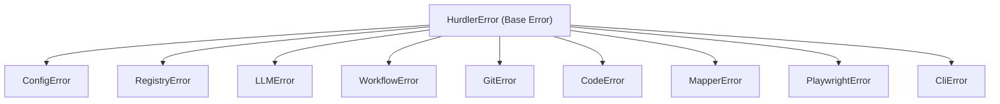

# Error Hierarchy & Recovery

Hurdler employs a typed, explainable error hierarchy rooted in `HurdlerError`. Every error specifies a machine-readable error code, human explanation, and suggested remediation steps.

---

## 🏛️ Error Class Hierarchy



---

## 🛠️ Error Codes & Diagnostics

| Error Code | Class | Common Cause | Remediation |
|---|---|---|---|
| `CONFIG_NOT_FOUND` | `ConfigError` | Missing `.hurdler/config.json` | Run `hurdler init` |
| `KEY_NOT_FOUND` | `LLMError` | Missing API key in `.env` | Set key in `.env` or via `hurdler keys set` |
| `MODEL_NOT_FOUND` | `RegistryError` | Model ID not in registry | Check `hurdler llms list` or register it |
| `LINT_FIX_FAILED` | `CodeError` | Syntax or lint error cannot be auto-fixed | Trigger Debugger Agent loop |
| `GIT_DIRTY_TREE` | `GitError` | Uncommitted changes in working directory | Stash or commit changes |
| `AST_PARSE_ERROR` | `MapperError` | Invalid JavaScript/TypeScript syntax | Verify file contents with parser |

---

## 📑 Handling Errors Programmatically

```typescript
import { HurdlerError, isHurdlerError } from 'hurdler';

try {
  await executeWorkflow('feature-builder');
} catch (error) {
  if (isHurdlerError(error)) {
    console.error(`[${error.code}] ${error.message}`);
    if (error.remediation) {
      console.info(`Suggested Fix: ${error.remediation}`);
    }
  } else {
    console.error('Unexpected error:', error);
  }
}
```
