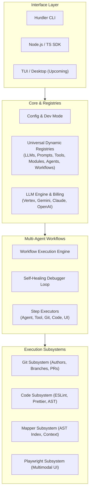

# Overview & Philosophy

**Hurdler** is an AI agentic software engineering platform built in Node.js. It equips Large Language Models (LLMs) with a robust execution environment, structured context, and specialized tooling to function with the full capability of senior software engineers.

---

## 🎯 The Core Philosophy: KISS & Function-First

Unlike monolithic agent frameworks with deep class inheritance and opaque state, Hurdler is designed around **pure, modular TypeScript functions**:

1. **Isolation of Concerns**: Every subsystem (LLMs, Prompts, Tools, Modules, Agents, Workflows, Git, Code, Mapper, UI, CLI) operates as an independent, testable module.
2. **Stateless Operations**: Functions accept explicit inputs and return typed outputs without hidden side effects.
3. **Adaptive Workflows**: LLMs have varying reasoning limits. Large frontier models can execute end-to-end multi-file features with security and business logic, while smaller models execute single-responsibility steps (e.g. creating business logic, adding validation schemas, fixing lint errors). Hurdler workflows dynamically combine prompts, tools, and agents to fit any model's capability.
4. **Git-Native Collaboration**: Agents do not write unversioned files. Every agent has their own Git author identity, commit history, feature branches, and pull request workflows.
5. **AST & Self-Healing Pipeline**: Automatic linting (ESLint), formatting (Prettier), and AST analysis (ts-morph, tree-sitter) ensure code is continuously verified and healed via debugger agent loops.

---

## 🏛️ Platform Architecture

---

## 🧭 Key Subsystems at a Glance

- **Universal Dynamic Registries**: Static and runtime-persisted registries stored as JSON in `.hurdler/registries/`.
- **LLM Engine**: Multi-provider adapters with automatic token billing, cost estimation, and key management.
- **Git Engine**: Complete version control management via `simple-git`, allowing multi-agent co-authorship.
- **Code Pipeline**: Automated ESLint diagnostics, Prettier code beautification, and AST parsing via `ts-morph` and `tree-sitter`.
- **Project Mapper**: Full-codebase symbol mapping, context slicing for prompt budgets, and impact blast-radius analysis.
- **Playwright Engine**: Automated headless browser testing, visual screenshots, and DOM inspection for multimodal agent reasoning.
- **CLI Dispatcher**: Unified command-line interface with colorized ASCII tables and machine-readable `--json` output.
