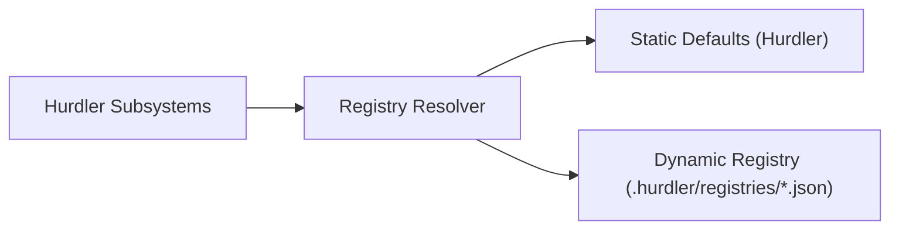

# Universal Registry Pattern

The **Universal Registry Pattern** provides a uniform, strongly typed CRUD interface across all 6 core registries in Hurdler:
1. **LLMs Registry** (`llms.json`)
2. **Prompts Registry** (`prompts.json`)
3. **Tools Registry** (`tools.json`)
4. **Modules Registry** (`modules.json`)
5. **Agents Registry** (`agents.json`)
6. **Workflows Registry** (`workflows.json`)

---

## 🏛️ Static + Dynamic Dual Persistence

Every registry in Hurdler operates with two layers:
1. **Static Defaults**: Built-in, battle-tested registry definitions bundled in Hurdler.
2. **Dynamic Project Overrides**: Local project-specific definitions stored in `.hurdler/registries/<name>.json`.

When querying a registry, Hurdler seamlessly merges static defaults with dynamic project overrides, giving precedence to local configurations.

---

## 📑 Common Registry Functions

Every registry exports the following standardized functional interface:

| Function Pattern | Purpose |
|---|---|
| `get<Item>Registry(cwd?)` | Returns the active registry instance |
| `list<Items>(filter?, cwd?)` | Lists items matching optional criteria |
| `get<Item>(id, cwd?)` | Retrieves a single item by unique ID |
| `register<Item>(entry, cwd?)` | Adds a new entry and persists to `.hurdler/registries/` |
| `update<Item>(id, updates, cwd?)` | Updates an existing entry |
| `remove<Item>(id, cwd?)` | Deletes an entry from dynamic storage |
| `sync<Items>(cwd?)` | Synchronizes disk entries with active memory cache |
