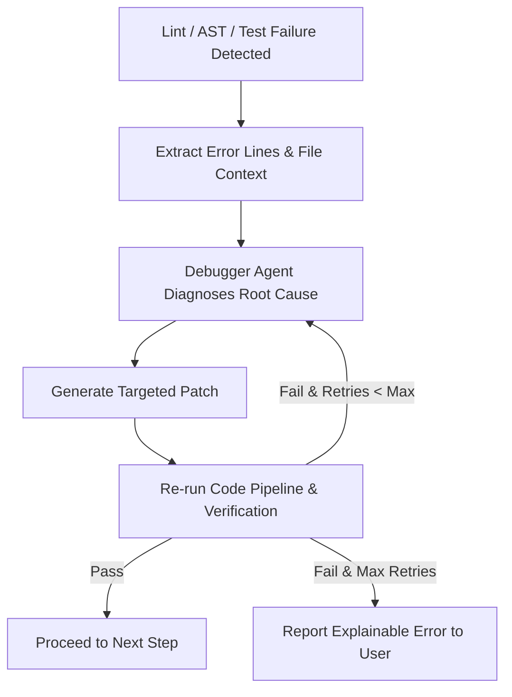

# Debugger & Self-Healing Loop

When a lint error, syntax issue, or test failure occurs during code generation, the **Debugger Loop** activates automatically to diagnose and resolve the failure.

---

## 🔄 Self-Healing Process



---

## 📑 Configuration

Set maximum retry attempts in `.hurdler/config.json`:

```json
{
  "code": {
    "maxDebuggerRetries": 3
  }
}
```
