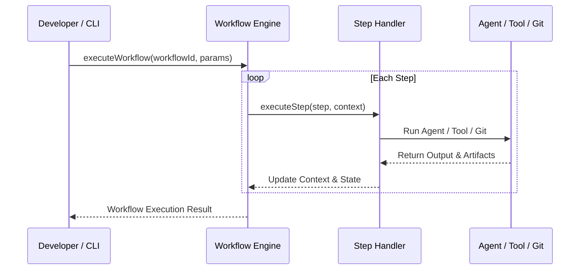

# Workflow Orchestration Engine

The **Workflow Engine** coordinates autonomous multi-agent pipelines, passing typed context between steps and handling transitions, retries, and errors.

---

## 🏛️ Execution Flow



---

## 📑 Programmatic API Reference

### `executeWorkflow(workflowId: string, params?: Record<string, any>): Promise<WorkflowResult>`

```typescript
import { executeWorkflow } from 'hurdler';

const result = await executeWorkflow('full-feature-pipeline', {
  goal: 'Create user profile page component',
  targetDir: 'src/components/profile'
});

console.log('Status:', result.status);
console.log('Artifacts:', result.artifacts);
```
